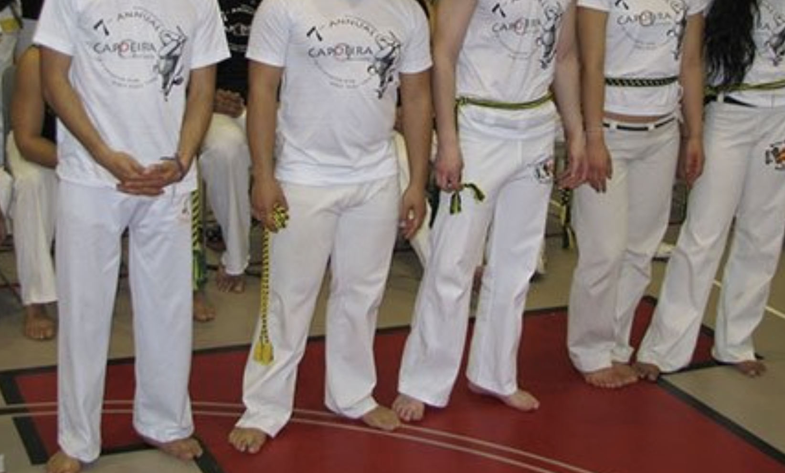
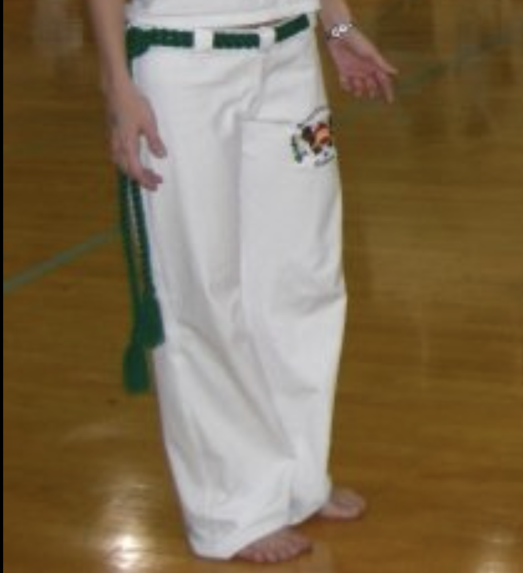

After 20+ years of doing Capoeira, it's very clear that women have it tough when finding Abadas that fit. Most Abadas are low-cut, transparent, and generally uncomfortable. Because they were often designed with a "unisex" (read: male) template, and the design has not evolved in decades. 

I dedicated a lot of time researching athletic textile engineering to create a pair of Capoeira pants that function as a high-performance school uniform, and lets you feel comfortable and confident while training. 

## The three biggest issues women have with their Abadas

### Transparency (the squat test)

Abadas are notoriously transparent. Especially with everyone squatting and moving around. Transparency is affected by material, color, and fabric density (measured in GSM).

Traditional Abadas are made from helanca. Helanca is a synthetic stretch fabric. It's durable, but has a low GSM (Grams per Square Meter) and weave of the fabric make Abada fabric more see-through than most modern athletic pants. Helanca Abadas often fail the squat test.

Whatever the reason, Abadas made with the more traditional Helanca, tend to be see-through, which is very uncomfortable for women (and men!).  

For context here are the GSM values of other pants you might encounter in your daily life. 

| Clothing Type (Material Composition) | Typical GSM | Key Traits | See-through-ness |
| --- | --- | --- | --- |
| Abada Joggers (75% nylon / 25% spandex, 230 GSM) | 230 GSM | Smooth, high stretch, athletic feel, moisture-wicking, holds shape well | Low. generally opaque |
| Traditional Abadas (helanca = polyester/polyamide blend) | under 220GSM | Very durable, stretchy, retains moisture | Often see through |
| Jeans (100% cotton denim) | 300–450 GSM | Very durable, structured, rigid at first, softens over time | Not see-through |
| Leggings (polyester/spandex or nylon/spandex, ~80–90% / 10–20%) | 180–300 GSM | Stretchy, form-fitting, breathable, designed for movement | Risky below 220GSM |
| Linen Pants (100% linen) | 150–250 GSM | Very breathable, lightweight, airy, wrinkles easily | Higher risk in lighter colors |

What we tried to do was find the "goldilocks zone" between light and comfortable, and enough GSM to not be see-through. It's a delicate balance. But our main goal was to make sure Abadas were tough enough for training, and dense enough so you don't show your underwear to the bateria.

### A poor fit around the waist

Traditional Abadas usually have two bad options.  

A) your abadas are too tight! in which case you feel like the life is being squeezed out of you from the hips. 

B) You get a bigger size. Its more roomie, but the excess fabric bunches like a diaper. And now the sizing is very awkward in the leg and waist.

This is mostly due to Capoeira pants being sized for men. Traditional Abadas ignore women's waist to hip ratio. When a woman wears a traditional Abada, the fabric stretches over the hips (becoming more transparent), and sags at the waist. 

Meaning, often times there is no "correct" size for you.

### Inconsistent and unflattering fit

One of the biggest frustrations about ordering Abadas as a student is that you have no idea what you will be getting. Many providers in Brazil are small scale manufacturers. There is no constant sizing within the industry. 

A *small* this year might be a *medium* next year. measurements of leg length, inseam, and waist can be totally different depending on who you order from. I've been a small and a medium at different times of my life. Not from gaining weight, but from the manufacturer changing their measurements one year to the other. 

### Abadas from Brazil never improve

Besides the inconsistency, the fit never seems to improve! 

Wide legs, narrow hips, and a wide waist makes you wonder who these pants were made for… Yes, Abadas were made with men in mind, but even the men look terrible in them. In terms of the fit, the biggest issues that make Capoeira pants unflattering to women are…

1. The low rise (low-cut)
2. Balloon leg opening
3. Narrow hip sizing
4. Wide waist sizing (or lack of elastic waist)
5. Narrow thigh sizing

Solving these problems alone would make greatly improve how people feel towards their Abadas. But after a 20+ years, it doesn't look like that will happen any time soon. 

## How we re-engineered Capoeira pants women love

One of the most well-known female Capoeiristas in the world once whispered to me at an event "*Eu odeio Abadas*". I hate Abadas. She's not the only one. It's clear that we need a new Abada design that women actually want to wear. 

### Perfecting the silhouette for women

I'll be the first to admit, anytime you have a unisex pant, it's not going to fit everyone. Men and women have different sizing ratios so it's not going to be perfect. But there are things you can do. 

To make sure our Abadas fit the most people well we've done the following. 

1. **Add additional room in the rear.** This does a lot of work to reduce transparency and improve comfort around the hips. 
2. **Add room in the upper leg (thighs).** Yes, this ads comfort, but also gives a more flattering fit when combined with a taper on the lower leg.
3. **An elastic waist band.** Women tend to have diverse waist to hip ratios. The elastic band makes the fit comfortable for most people.
4. **A mid rise.** Does wonders for protecting your behind. 

Your Abadas should be flattering, so these design choices were critical. But don't go thinking I'm a genius who came up with this. 

Most long-term Capoeiristas have spent a fortune going to the tailor to shorten the leg and taper the ankles. I'm one of them. I can't tell you how much money I've personally spent. 

I simply built those community-led "improvements" directly into the Abada Joggers. After years of going to the tailor, now we have Capoeira pants that fit off the shelf!

> "Had my eye on these for a while & finally purchased! I was very pleasantly surprised to see the fabric isn't as transparent as I thought it would be! I tried on a variety of undergarments with them and you couldn't even make out the pattern through the pants fabric! I feel much better wearing these to an event knowing that everyone won't be able to see right through the pants I'm wearing. Will definitely be purchasing more."  - Angela 

### The material, from helanca to a stretch blend

Helanca is an old-school stretch fabric. The original athletic fabric that appeared in Brazil in the mid 20th century. The fabric was great for the time, but doesn't hold up to modern athletic fabrics. 

[I have a whole blog post about the history.](https://dendearts.com/blog/what-are-capoeira-uniforms-made-of/) 

Our Abadas use a premium nylon-elastane blend at 230gsm. It's moves well, easy to clean, and durable. Truth be told, it's a delicate balance that took over a year. Too-thin and the Abada is see-through. Too thick and it feels like wearing leather. Even something small like a fabric weaves can make the difference, but sourcing a good quality material was well worth it. 

Speaking from experience, the material chosen does a good job covering everyone's butt without feeling restrictive.  

> "These are precisely what I was looking for. Really comfortable, great fit, and no transparency at the back — which has always been my biggest frustration with traditional abadá pants… Obrigada, axé!"  - Francesca

### Pockets for all your knik-knaks

Pockets, yes, really!!

Another feature nobody seems to think about are zippered pockets. I swear, go to a roda with zipper pockets. It will blow people's mind. 

Adding pockets and a back pocket with a zipper was a big quality of life upgrade for Abadas. These have been super helpful during events when I need to move my things around the space, or if I just need my phone on me.  Anyone who's worn Abadas for long enough knows how much of an upgrade something as simple as pockets can be.  

Interestingly, a lot of the old-school doesn't believe Abadas should have pockets. But the new-school is in agreement that it's an upgrade worth keeping. 

> "Very polished look, light weight, stretchy, with a useful zip pocket in the back for your dobrão."  - Tiazinha

Angoleiros might love this because here you can place your dobrão. Many an Angoleiro have dropped their back pocket dobrão because they don't have a zipper for the pocket! 

## A flattering look for the roda or a grocery story run

When I first started training Capoeira, I always felt weird wearing my Abadas out to something other than Capoeira. Not only was I dressed all in white, but the fit was so weird. It doesn't look like anything anyone would voluntarily wear. This is why it was so important to have a look that is functional for the roda, and also for going out and about. 

Friends have told me they plan to go out to parties wearing their Abada Joggers. Great. Never thought I'd see somewhere Capoeira pants at a party, but here we are. The fit is made to look like any other workout pants you might find at Lululemon, Uniqlo, or Nike. A flattering fit that you can use on your grocery store runs… or a party, I guess. 

## Alternate Abadas that you can wear with your cord

A lot of people ask if they can wear their cord with these Abadas. 

These are Abada Joggers are meant to be Abadas. Abadas that you can wear out, feel comfortable training, and wear with your cord. It doesn't matter if you use the yarn or cotton cords. Both fit. Your teacher might have something to say, but just remind them… for you to get the same fit with Brazilian Abadas, you would need to spend a lot of money on customization with the tailor. This is your way of saving money and making the school look good. Because if you look good, then your teacher looks good. 

## Belt loops

Ok, this is a small detail, but I actually spent a bunch of time thinking about belt loop placement. I have seen some Abadas with 5 belt loops and it gives a flimsy feel. Maybe this is a cost cutting measure, but the seven belt loops are place in such a way to keep your chord comfortably up. It might be a small detail, but having enough belt loops makes sure to distribute the weight around your waist. 

## Women feel proud to wear their Abada

> "I'm seriously impressed. The quality and fit are on another level compared to most capoeira pants I've trained in. You can tell real capoeiristas designed these... Highly recommend for anyone who wants performance AND style in their capoeira gear."  - Bianca

Something a lot of women have mentioned in reviews and private messages has been that they feel proud to wear these Abadas. They love that they are not see-through. They love the comfort and build quality. They love the fit. And that makes me happy.

If you're tired of baggy, awkward, or see-through pants, it's time to try an Abada designed with you in mind.